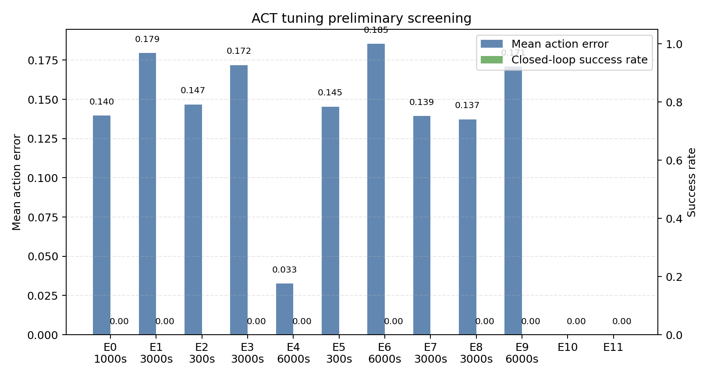

# ACT 调参实验阶段小结

## 结论先行

- 当前已经跑通 10 组离线 1000/300/3000/6000-step、batch 4 的本机中等筛选，以及 9 组闭环部署记录。
- 这些结果已经能做超参数趋势分析，但仍不能替代 3000/6000 steps、5 seeds 的最终结论。
- 从第一性原理看，离线动作误差只衡量数据分布内的模仿距离；闭环成功率还会暴露误差累积、视觉状态偏移和动作平滑滞后。
- 当前最低离线动作误差是 E4 (0.0326)，数据集为 30 random demos；这是随机初始位置数据上的当前最优离线结果，优先进入闭环复测。
- 在随机初始位置数据上，当前离线最优是 E4 (0.0326, 6000 steps)，可作为下一轮闭环验证优先候选。
- E6 的 final loss 为 0.1952，但动作误差为 0.1853；这说明 loss 下降不能单独代表控制质量。
- E1 保留了 120-step 闭环失败视频，可作为轨迹偏移和误差累积的失败样例。
- 3000-step 随机数据对照中，E3 最优 (0.1719)，E1 最差 (0.1795)。
- E4 已补跑到 6000 steps，动作误差为 0.0326，闭环结果为 max_steps+native_crash (80.0 steps)。
- E6 已补跑到 6000 steps，动作误差为 0.1853，闭环结果为 max_steps+native_crash (40.0 steps)。
- E9 已补跑到 6000 steps，动作误差为 0.1709，闭环结果为 max_steps+native_crash (40.0 steps)。
- 6000-step 深跑组已有 3 组闭环记录，失败模式为 max_steps+native_crash，说明当前瓶颈已从离线拟合转向闭环控制。
- 闭环部署已有 9 组记录；当前失败模式包括 max_steps, max_steps+native_crash, native_crash。
- `native_crash` 属于 MuJoCo/GLFW native 层异常，不能直接当作策略失败；需要优先复现实验窗口稳定性。

## 当前结果表

| ExpID | Dataset | chunk | lr | steps | mean_action_error | success_rate | avg_steps | failure_mode | video |
| --- | --- | ---: | ---: | ---: | ---: | ---: | ---: | --- | --- |
| E0 | 30 random demos | 50 | 0.0001 | 1000 | 0.1396 | 0.00 | 0.0 | native_crash |  |
| E1 | 30 random demos | 25 | 0.0001 | 3000 | 0.1795 | 0.00 | 120.0 | max_steps | deployment_20260606_205442.mp4 |
| E2 | 30 random demos | 50 | 0.0001 | 300 | 0.1468 |  |  | manual_review |  |
| E3 | 30 random demos | 100 | 0.0001 | 3000 | 0.1719 | 0.00 | 0.0 | native_crash |  |
| E4 | 30 random demos | 50 | 5e-05 | 6000 | 0.0326 | 0.00 | 80.0 | max_steps+native_crash | deployment_20260606_212536.mp4 |
| E5 | 30 random demos | 50 | 0.0001 | 300 | 0.1453 |  |  | manual_review |  |
| E6 | 30 random demos | 50 | 0.0002 | 6000 | 0.1853 | 0.00 | 40.0 | max_steps+native_crash | deployment_20260606_220644.mp4 |
| E7 | 3 fixed demos | 50 | 0.0001 | 3000 | 0.1394 |  |  | manual_review |  |
| E8 | 50 fixed demos | 50 | 0.0001 | 3000 | 0.1372 | 0.00 | 0.0 | native_crash |  |
| E9 | 30 random demos | 50 | 0.0001 | 6000 | 0.1709 | 0.00 | 40.0 | max_steps+native_crash | deployment_20260606_220731.mp4 |
| E10 | 30 random demos | 50 | 1e-4 |  |  | 0.00 | 120.0 | max_steps | deployment_20260606_172034.mp4 |
| E11 | 30 random demos | 50 | 1e-4 |  |  | 0.00 | 120.0 | max_steps | deployment_20260606_173100.mp4 |

## 面试讲法

- 离线到闭环：离线误差降低后仍要做 MuJoCo 闭环部署；max_steps 失败更接近策略问题，native crash 则要归因到实验平台稳定性。
- 数据分布：固定初始位置的离线误差更低，优先解释为训练/验证更贴近同一分布；是否真能泛化，必须看随机位置闭环部署。
- Action chunk：3000-step 下 chunk25 和 chunk100 的动作误差都高于 E4，说明 chunk 长短不能只看训练 loss，要结合动作误差与闭环轨迹。
- 学习率：E6 的 lr=2e-4 让 loss 很低，但动作误差最高之一，说明过快收敛可能没有带来更好的控制动作。
- 深跑验证：E4/E6/E9 都已有 6000-step 多 seed 闭环记录；其中 max_steps 更接近策略闭环失败，native_crash 要单独归因为 MuJoCo/GLFW 平台稳定性。
- Temporal ensemble：平滑本质是在多个时间步预测之间做加权平均，能降低高频动作噪声，但权重过强可能带来响应滞后。
- 环境稳定性：native crash 和 max_steps 要分开记录；前者是实验平台可靠性问题，后者才更接近策略闭环表现问题。

## 简历素材

- 围绕 ACT 策略完成 10 组离线超参数/数据分布筛选，并用 MuJoCo 闭环部署验证离线误差与任务成功率之间的不一致。
- 对比 action chunk size、learning rate 和示范数据分布对动作误差、训练稳定性与闭环失败模式的影响，发现低 loss 与低动作误差并不总一致，并定位 max_steps、native crash 等不同失败来源。

## 下一轮正式实验

- E1/E3/E4/E6/E7/E8/E9 已经完成 3000 steps，E1/E6/E9 也有 max_steps 闭环失败视频。
- 下一步不再优先加长单组训练，而是继续补足 E4/E6/E9 的稳定闭环 seed，并复盘已有视频中的轨迹偏移模式。
- 复盘 E4/E6/E9 视频，优先定位抓取前对齐、接触后抖动、放置阶段偏移三类失败。最终只把最有解释价值的 3 组写入简历。
